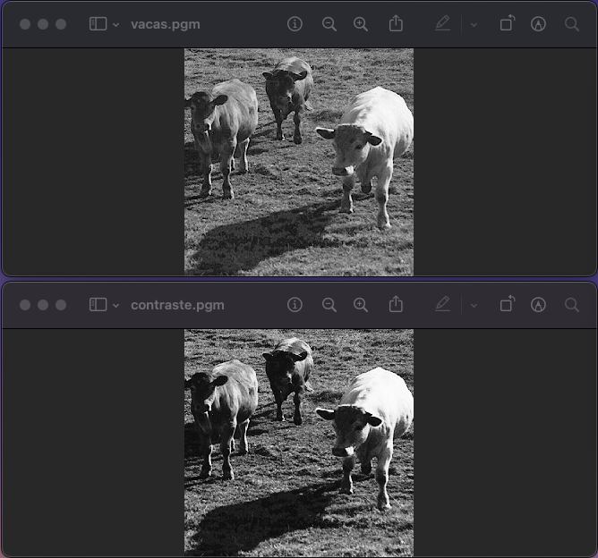

# TDA_Imagen

Primera práctica de la asignatura Estructuras de datos del primer cuatrimestre de 2º Ing. Informática de la UGR.  

Este no es el ejercicio completo, solo las funciones hechas. La práctica completa incluye otros aspectos como realizar la documentación estilo doxygen

## [Ejercicio 1](Ej_1/Ej_1.cpp)  

Especificación de la función:  

  

Resultado:  

 

## [Ejercicio 2](Ej_2/Ej_2.cpp)  

Especificación de la función:

 

Resultado: 

 

## [Ejercicio 3](Ej_3/Ej_3.cpp)  

Especificación de la función:  

  

Resultado:

## [Ejercicio 4](Ej_4/Ej_4.cpp) 

  

