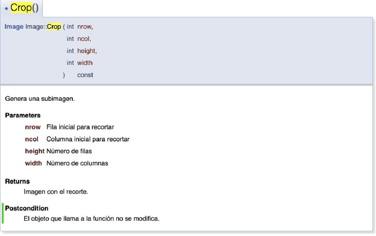
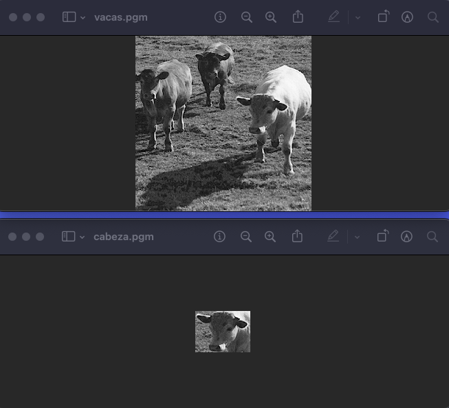
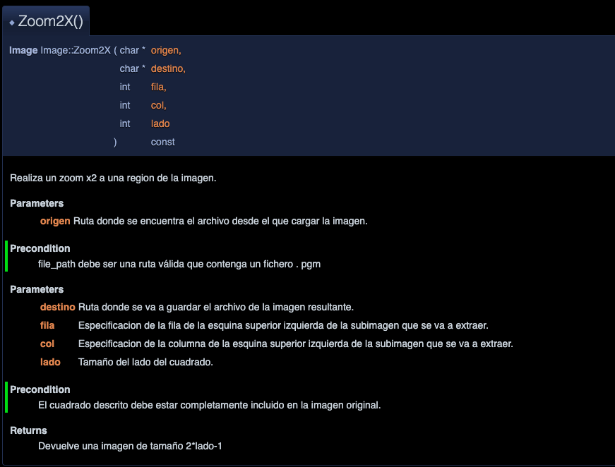
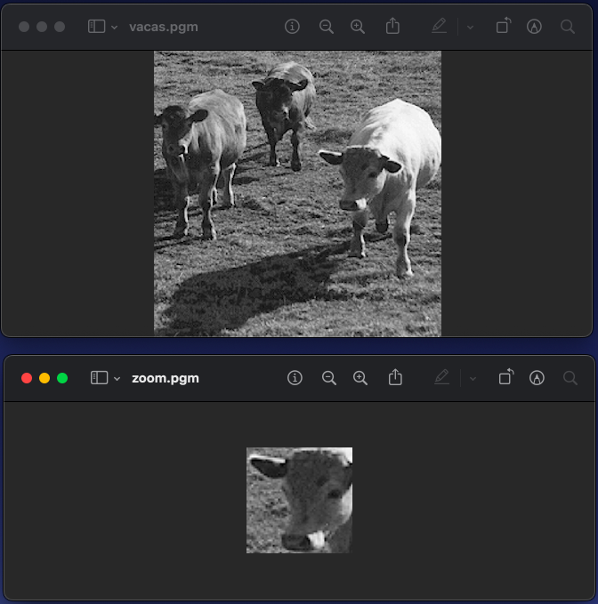
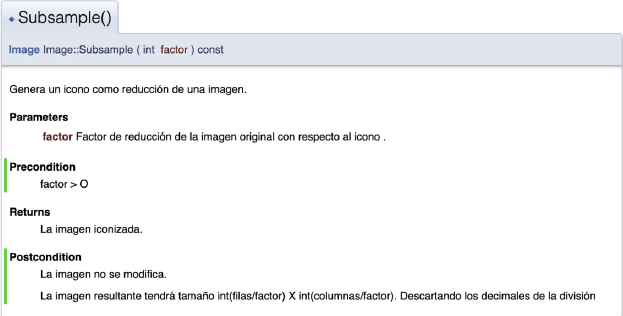
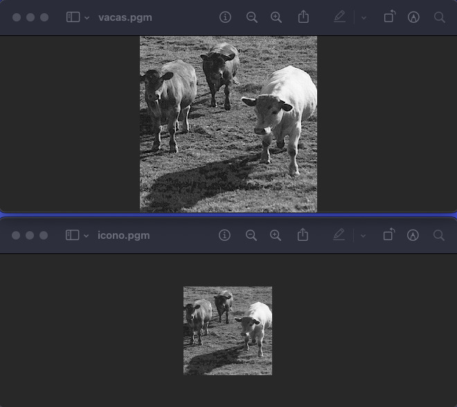
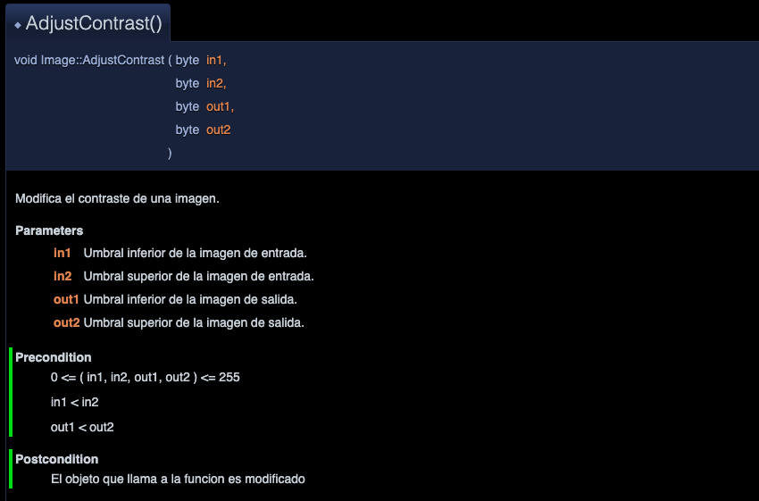

# TDA_Imagen

## Información útil  

Como en Prado se especifica que es solo uno de la pareja los que tienen que entregar la práctica, pues veo una tontería el subir todo el proyecto. Lo que he hecho es subir simplemente la declaración e implementación de la función, así como un main en el mismo archivo. Así que cuando tengas terminado los ejercicios pues simplemente crea una carpeta y así lo tenemos todo más organizado a la hora de entregarlo. Si tienes alguna duda de como subir archivos al github desde la terminal o de lo que sea dime sin problema :)

## [Ejercicio 1](Ej_1/Ej_1.cpp)  

Especificación de la función:  

  

Resultado:  

 

## [Ejercicio 2](Ej_2/Ej_2.cpp)  

Especificación de la función:

 

Resultado: 

 

## [Ejercicio 3](Ej_3/Ej_3.cpp)  

Especificación de la función:  

  

Resultado:

## [Ejercicio 4](Ej_4/Ej_4.cpp) 

  

